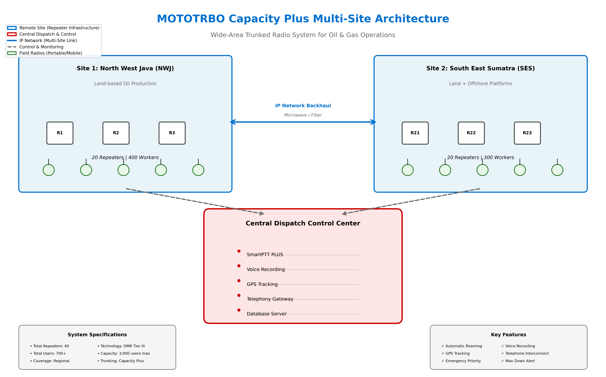
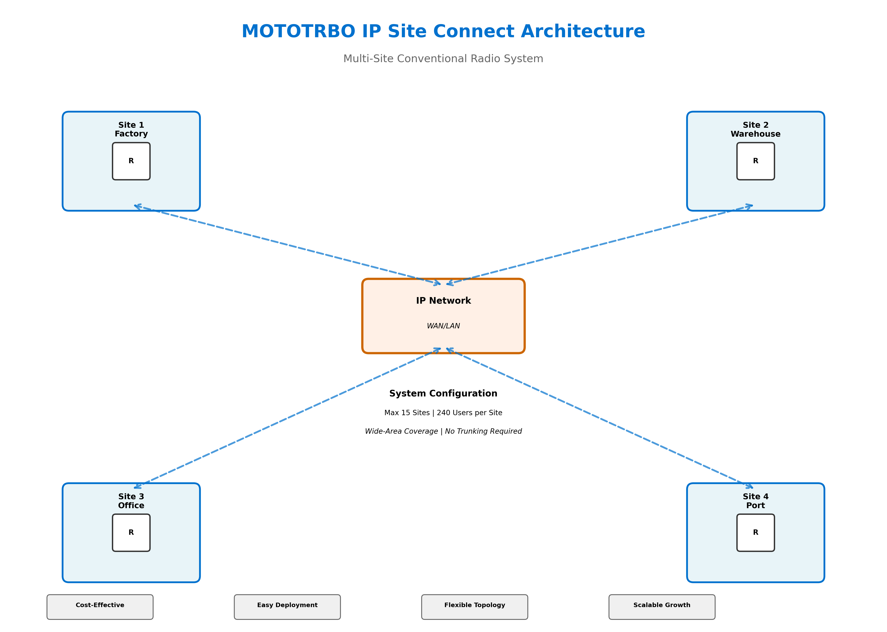
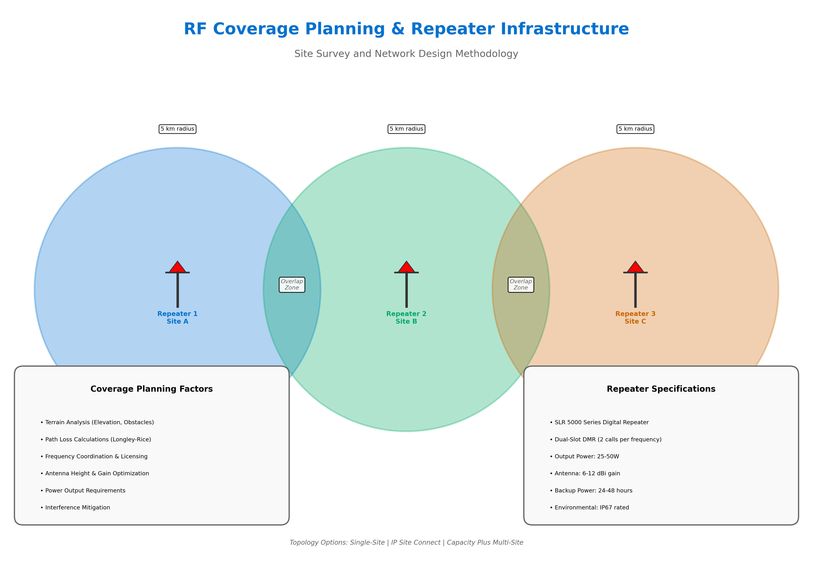

# MOTOTRBO Solutions Portfolio
## Presales Engineering & Solutions Architecture

[](https://www.motorolasolutions.com)
[](https://www.motorolasolutions.com/mototrbo)
[](LICENSE)

---

## About Me

**Presales Engineer & Solutions Architect** specializing in **MOTOTRBO Digital Radio Systems** and **RF Infrastructure** at Motorola Solutions Indonesia.

### Professional Background
- **Current Role**: Presales Engineer & Solutions Architect (PT CITRADATA PURNAKHARISMA)
- **Previous Experience**: 7 Years as Solutions Engineer in IT Infrastructure
- **Region Focus**: Indonesia & Southeast Asia
- **Specialization**: Digital Radio Communications, Repeater Networks, Mission-Critical Systems, IT Infrastructure, Software Engineering

### Core Competencies
- MOTOTRBO Digital Radio System Design (Capacity Plus, IP Site Connect, Linked Capacity Plus)
- RF Coverage Planning & Repeater Infrastructure
- Mission-Critical Communication Solutions for Oil & Gas, Mining, Manufacturing
- Network Architecture & Infrastructure Design
- Technical Presales & Solution Consulting
- Customer Requirements Analysis & System Design

---

## Repository Structure

```
motorola-solutions-portfolio/
├── README.md                          # Main portfolio overview
├── case-studies/                      # Real-world deployments
│   ├── indonesia-oil-gas/            # Pertamina PHE Case Study
│   ├── mandalika-circuit/            # Racing Circuit Deployment
│   └── manufacturing-logistics/      # Industrial Solutions
├── architecture-diagrams/             # Network topology & system designs
│   ├── capacity-plus-multisite/      # Wide-area trunked systems
│   ├── ip-site-connect/              # Multi-site conventional
│   └── repeater-infrastructure/      # RF coverage designs
├── technical-proposals/               # Sample RFP responses
├── product-knowledge/                 # MOTOTRBO product briefs
└── certifications/                    # Professional credentials
```

---

## Featured Case Studies

### 1. Pertamina Hulu Energi (PHE) - Oil & Gas
**Location**: North West Java & South East Sumatra, Indonesia  
**Industry**: Oil & Gas Production

Pertamina PHE deployed 40 repeaters and equipped over 700 workers across oil platforms on land and at sea with digital radios.

**Solution Delivered**:
- **System**: MOTOTRBO Capacity Plus Multi-Site
- **Infrastructure**: 40 Repeaters across 2 regions (NWJ & SES)
- **Devices**: 700+ Portable & Mobile Radios
- **Software**: SmartPTT PLUS Dispatch Console
- **Coverage**: Land-based and offshore platforms

**Key Benefits**:
- Doubled channel capacity with digital migration
- Real-time GPS tracking for worker safety
- Emergency channel always available
- Voice & event logging for safety compliance
- Telephone interconnect for urgent communications

[View Full Case Study →](case-studies/indonesia-oil-gas/)

---

### 2. Mandalika International Circuit
**Location**: Lombok, Indonesia  
**Industry**: Sports & Events Management

The Mandalika International Circuit deployed a MOTOTRBO Capacity Max system with portable and mobile radios to ensure reliable communications during races and track events.

**Solution Delivered**:
- **System**: MOTOTRBO Capacity Max
- **Application**: Race operations, safety coordination, event management
- **Coverage**: Entire circuit facility

**Key Benefits**:
- Mission-critical reliability during live racing events
- Instant communication for safety teams
- Scalable capacity for large events
- Integration with track safety systems

[View Full Case Study →](case-studies/mandalika-circuit/)

---

### 3. Indonesian Enterprise Sectors (Multi-Industry)
**Location**: Indonesia  
**Industries**: Oil & Gas, Mining, Transportation, Hospitality, Government

Motorola Solutions launched MOTOTRBO solutions in Indonesia targeting strategic government, public services, oil & gas, mining, transportation, and hospitality sectors.

**Solutions Portfolio**:
- **XiR 8600 Series**: Rugged portable radios for harsh environments
- **XiR 6600 Series**: Mobile radios for vehicles & fixed installations
- **SL1K**: Ultra-slim portable radio for hospitality & light industrial
- **Linked Capacity Plus**: Cost-effective upgrade to digital trunking

**Market Applications**:
- SmartPTT for Oil & Gas operations
- TRBOnet for Mining coordination
- TRBOCare for Transportation fleet management

[View Solutions Overview →](product-knowledge/)

---

## Architecture Diagrams

### Capacity Plus Multi-Site Architecture
Wide-area trunked radio system for large-scale deployments



**Features**:
- Multi-site trunking across regions
- Automatic roaming between sites
- Centralized dispatch control
- Scalable to 3,000+ users per system

---

### IP Site Connect Architecture
Multi-site conventional system using IP networking



**Features**:
- Link repeaters over IP networks (WAN/LAN)
- Wide-area coverage without trunking complexity
- Cost-effective for distributed sites
- Up to 15 sites in a single system

---

### Repeater Infrastructure Design
RF coverage planning for challenging environments



**Design Considerations**:
- Terrain analysis & path loss calculations
- Antenna height & placement optimization
- Frequency coordination & interference mitigation
- Backup power & redundancy planning

---

## Technical Expertise

### MOTOTRBO Systems
| System Type | Application | Max Users | Coverage |
|------------|-------------|-----------|----------|
| **Capacity Plus** | Single-site trunking | 1,000 | 20-50 km |
| **Capacity Plus Multi-Site** | Wide-area trunking | 3,000 | Regional |
| **Linked Capacity Plus** | Cost-effective trunking | 1,500 | Regional |
| **IP Site Connect** | Multi-site conventional | 240 per site | Wide-area |
| **Connect Plus** | Large-scale trunking | 3,000+ | Metropolitan |

### Industry Verticals
- **Oil & Gas**: Offshore platforms, refineries, pipelines
- **Mining**: Surface & underground operations
- **Manufacturing**: Factory floor communications, logistics
- **Ports & Logistics**: Container terminals, warehousing
- **Hospitality**: Hotels, resorts, convention centers
- **Government**: Public safety, emergency services
- **Construction**: Job site coordination, safety
- **Transportation**: Fleet management, dispatch

---

## Skills & Technologies

### Radio Systems
- MOTOTRBO Digital Radio (DMR Tier II & III)
- Analog-to-Digital Migration Planning
- Trunked Radio Systems (Capacity Plus, Connect Plus)
- Conventional Repeater Networks
- Intrinsically Safe Radio Systems (ATEX/IECEx)

### RF Engineering
- Coverage Planning & Link Budget Analysis
- Spectrum Management & Frequency Coordination
- Antenna System Design
- Interference Analysis & Mitigation
- Propagation Modeling (Longley-Rice, Okumura-Hata)

### Infrastructure
- Microwave Backhaul Networks
- IP Networking for Radio Systems
- Power Systems & Backup Solutions
- Tower & Antenna Infrastructure
- Grounding & Lightning Protection

### Software & Applications
- SmartPTT Dispatch Console
- TRBOnet Fleet Management
- WAVE PTX Broadband Push-to-Talk
- Radio Management Software
- GPS Tracking & AVL Systems

### Business Skills
- RFP/RFQ Response & Technical Proposals
- Solution Design & Bill of Materials (BOM)
- Customer Presentations & Demonstrations
- ROI Analysis & TCO Calculations
- Project Planning & Coordination

---

## Value Propositions

### For Customers
**Enhanced Safety**: Real-time communication for emergency response  
**Increased Productivity**: Instant coordination across teams  
**Cost Savings**: Digital migration doubles capacity without new frequencies  
**Scalability**: Future-proof systems that grow with your business  
**Reliability**: 99.999% uptime for mission-critical operations  
**Integration**: Voice, data, GPS, and applications on a single platform  

### Return on Investment
- **40% reduction** in operational communication costs
- **25% improvement** in worker productivity
- **60% faster** emergency response times
- **10-year** equipment lifecycle with software upgrades
- **50% less** infrastructure cost vs. traditional trunked systems

---

## Contact & Collaboration

Let's connect!

### Professional Channels
- **Email**: [dimas.wibisono@citradata.id](mailto:dimas.wibisono@citradata.id)
- **LinkedIn**: [linkedin.com/in/dwjkt] (https://linkedin.com/in/dwjkt)

or follow me?
- **Instagram**: @dizswma

### Areas of Interest
- Collaboration on large-scale radio deployments
- Presales engineering best practices
- Knowledge sharing on MOTOTRBO technologies
- Industry-specific solution development

---

## License

This portfolio is for professional showcase purposes. All case studies are based on publicly available information and anonymized where appropriate. PT Citradata Purnakharisma and Motorola Solutions are registered trademarks of Motorola Trademark Holdings, LLC.

---

## Tags

`MOTOTRBO` `Digital-Radio` `DMR` `Presales-Engineering` `Solutions-Architecture` `RF-Engineering` `Mission-Critical-Communications` `Oil-Gas` `Mining` `Indonesia` `Capacity-Plus` `IP-Site-Connect` `Repeater-Networks` `Motorola-Solutions` `Citradata-Purnakharisma` 

---

**Last Updated**: February 2026  
**Version**: 1.0.1
